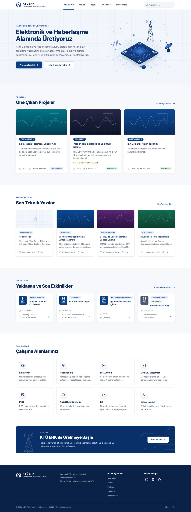
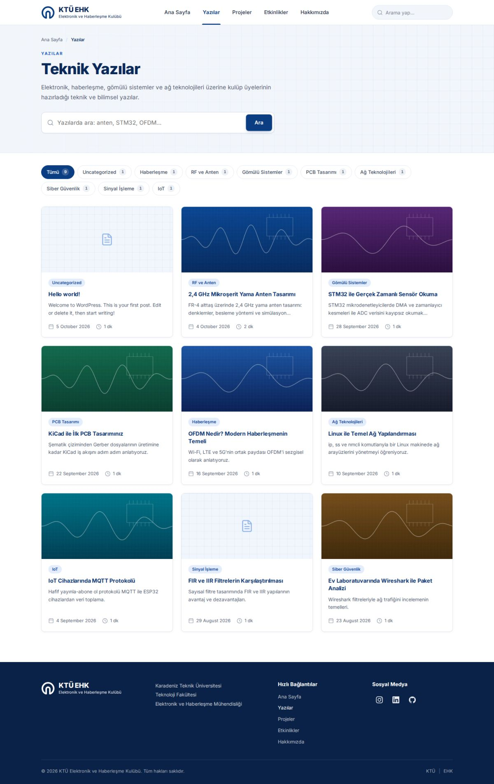
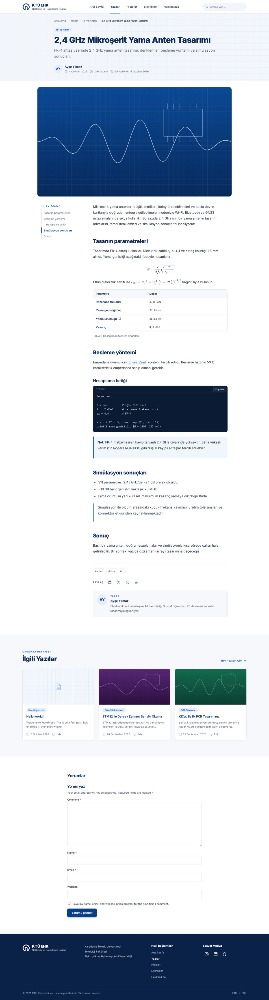
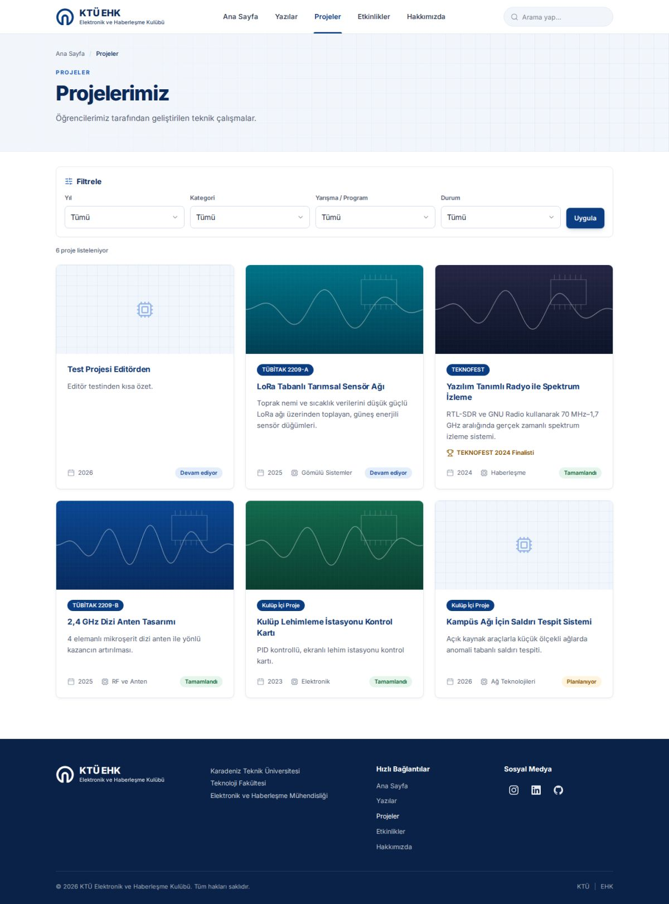
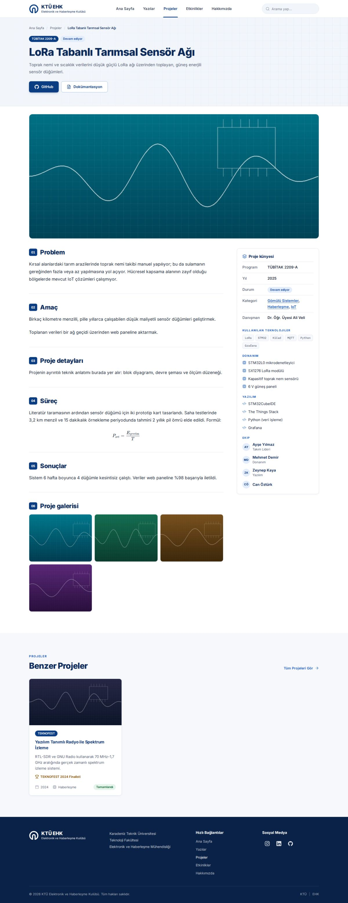
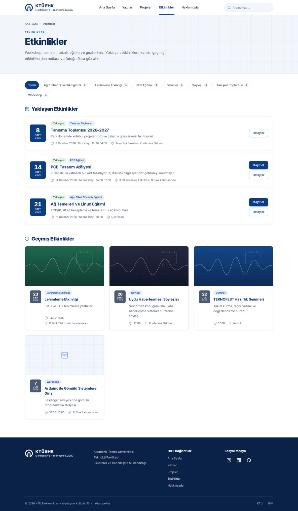
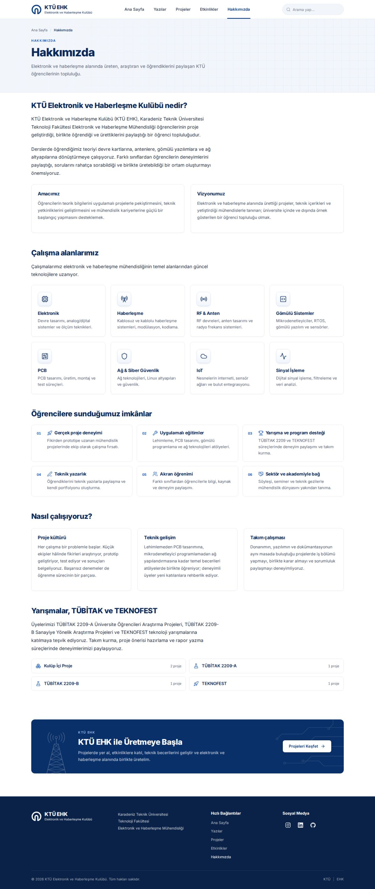
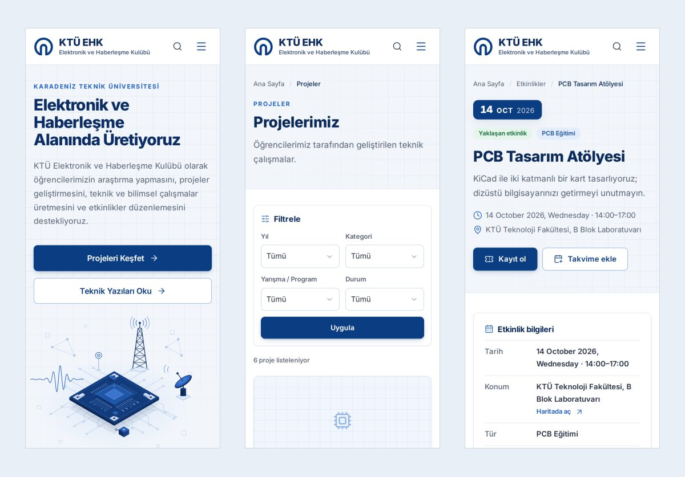

# KTÜ EHK — WordPress teması ve içerik eklentisi

KTÜ Elektronik ve Haberleşme Kulübü (ktuehk.com.tr) için yeniden tasarlanmış WordPress altyapısı. Bu depoda iki parça var:

| Klasör | Ne işe yarar |
| --- | --- |
| `wp-content/themes/ktuehk` | **KTÜ EHK teması**: tüm görünüm (ana sayfa, yazılar, projeler, etkinlikler, Hakkımızda, arama, 404). |
| `wp-content/plugins/ktuehk-core` | **KTÜ EHK Çekirdek eklentisi**: Projeler ve Etkinlikler içerik türleri, alanları, filtreleri, SEO/schema çıktısı. |

İçerik modeli bilerek eklentide tutuldu: tema ileride değiştirilse bile projeler ve etkinlikler kaybolmaz.



<details>
<summary>Diğer ekran görüntüleri</summary>

| Teknik Yazılar | Yazı detayı |
| --- | --- |
|  |  |

| Projelerimiz | Proje detayı |
| --- | --- |
|  |  |

| Etkinlikler | Hakkımızda |
| --- | --- |
|  |  |



Görüntüler test verisiyle alınmıştır.
</details>

---

## Önemli: Mevcut site hakkında

Geliştirme ortamından `ktuehk.com.tr` adresine erişilemedi (ağ politikası engeli), bu yüzden canlı sitenin teması, eklentileri ve içerik yapısı doğrudan incelenemedi. Bu nedenle sistem **mevcut yapıyı bozmayacak şekilde savunmacı** tasarlandı:

- Hiçbir içerik, ayar veya URL silinmez/değiştirilmez. Eklentinin silme (uninstall) rutini yoktur.
- Kalıcı bağlantı (permalink) yapısına dokunulmaz. Yazı ve sayfa adresleri aynen kalır.
- Sitede zaten bir **proje/etkinlik içerik türü** varsa yeniden oluşturulmaz; **Ayarlar › KTÜ EHK** ekranından anahtarı ve URL ön eki girilerek mevcut tür benimsenir (aşağıya bakın).
- Bir **SEO eklentisi** (Yoast, Rank Math, AIOSEO, SEOPress, The SEO Framework, Slim SEO) varsa meta etiketleri ve şema ona bırakılır; tema yalnızca SEO eklentilerinin üretmediği Event şemasını ekler.
- Eski temanın **logosu ve sosyal medya bağlantıları** tema değiştirildiğinde otomatik taşınır.
- **İletişim sayfasına ve içeriğine dokunulmaz.** Mevcut menünüzde İletişim bağlantısı varsa olduğu gibi kalır. Tema hiçbir yerde iletişim bilgisi (telefon, e-posta, adres) üretmez, tekrarlamaz veya öne çıkarmaz; alt bilgide yalnızca üniversite/bölüm adı yazar.

Canlıya almadan önce aşağıdaki kontrol listesini bir **hazırlık (staging) kopyasında** uygulamanız önerilir.

---

## Kurulum

### 0. Yedek alın
Hosting panelinizden veya bir yedekleme eklentisiyle **dosya + veritabanı yedeği** alın. Mümkünse önce bir staging kopyasında deneyin.

### 1. Dosyaları yükleyin
İki yoldan biri:

- **Yönetim panelinden (önerilen):** Ubuntu'da depo klasöründe `./bin/paketle.sh` çalıştırın. `dist/ktuehk-core.zip` dosyasını *Eklentiler › Yeni ekle › Eklenti yükle*, `dist/ktuehk.zip` dosyasını *Görünüm › Temalar › Yeni ekle › Tema yükle* ile yükleyin.
- **FTP/SFTP ile:** `wp-content/themes/ktuehk` ve `wp-content/plugins/ktuehk-core` klasörlerini sunucudaki aynı yerlere kopyalayın.

**Güncelleme:** Temanın önceki bir sürümü yüklüyse yeni `ktuehk.zip` dosyasını aynı şekilde *Tema yükle* ile yükleyin ve çıkan ekranda **"Mevcut olanı yüklenenle değiştir"** düğmesine basın. Ayarlarınız, menüleriniz ve içerikleriniz korunur.

### 2. Önce eklentiyi, sonra temayı etkinleştirin
1. *Eklentiler* › **KTÜ EHK Çekirdek** › Etkinleştir. (Varsayılan program, alan ve etkinlik türü terimleri bir kez oluşturulur.)
2. *Görünüm › Temalar* › **KTÜ EHK** › Etkinleştir.

Sıra ters olsa da sorun çıkmaz; tema, eklenti yoksa bir uyarı ve "Eklentiyi etkinleştir" bağlantısı gösterir.

### 3. Önerilen kurulumu tamamlayın
Tema etkinleştirildiğinde panelde **"KTÜ EHK teması — önerilen kurulum"** kutusu çıkar. Yapılacak adımları listeler ve yalnızca eksik olanları tamamlar:

- Ana sayfa "son yazılar" gösteriyorsa statik bir *Ana Sayfa* sayfası atanır (adres değişmez).
- Yazı listesi sayfası yoksa *Yazılar* sayfası (`/yazilar/`) oluşturulup atanır; `yazilar` adlı bir sayfa zaten varsa o kullanılır.
- *Hakkımızda* sayfası yoksa, düzenlenebilir hazır içerikle **taslak** olarak oluşturulur. İnceleyip yayımlayın.

### 4. Kontrol edin
- *Ayarlar › Genel › Site Dili*: **Türkçe** olmalı (tarih ve ay adları için; ör. etkinlik kutularında "18 EKİ 2026").
- *Ayarlar › Kalıcı bağlantılar*: değiştirmeden bir kez **Kaydet**'e basın (yeni URL'ler için kuralları yeniler).
- *Görünüm › Menüler*: Menü atanmamışsa tema otomatik olarak *Ana Sayfa, Yazılar, Projeler, Etkinlikler, Hakkımızda* menüsünü gösterir. Sitede zaten bir menü varsa onu "Ana menü (üst)" konumuna atayın; menüdeki tüm bağlantılar (İletişim dahil) aynen görünür. Alt bilgideki "Hızlı Bağlantılar" için "Alt bilgi — Hızlı bağlantılar" konumu kullanılır.
- *Görünüm › Özelleştir › KTÜ EHK Tema Ayarları*: üst menü rengi (**Beyaz** — varsayılan — veya KTÜ mavisi), koyu zemin logosu, ana sayfa üst bölümü (üst etiket, iki satırlık başlık, açıklama), "KTÜ EHK ile Üretmeye Başla" bandının metinleri, liste sayfalarının açıklamaları ve sosyal medya bağlantıları.

---

## Geçiş kontrol listesi (mevcut site için)

| Durum | Ne yapmalı |
| --- | --- |
| Eski temada/eklentide bir **proje veya etkinlik içerik türü** vardı | *Ayarlar › KTÜ EHK* › "Tanılama" tablosuna bakın. "Kayıtlı değil" görünen veya başka eklentiye ait türün **anahtarını** (ör. `project`) ve **mevcut URL ön ekini** (ör. `portfolio`) girip kaydedin. İçerik taşınmaz; aynı kayıtlar yeni tasarımla ve aynı adreslerle görünür. |
| Projeler normal **yazı** olarak bir "Projeler" kategorisinde tutuluyordu | Hiçbir şey bozulmaz; kategori sayfası yeni tasarımla çalışır. Projeleri yeni yapıya almak isterseniz *Post Type Switcher* gibi bir eklentiyle türünü değiştirebilirsiniz (eski adresler WordPress tarafından yeni adrese yönlendirilir). |
| Bir **SEO eklentisi** kullanılıyor | Ek işlem gerekmez; meta ve şema o eklentide kalır. |
| Sayfalar bir **sayfa oluşturucu** (Elementor vb.) ile yapılmış | İçerik korunur. Geniş düzen gerekiyorsa sayfa ayarlarından **"Tam genişlik"** şablonunu seçin. |
| Eski temanın **widget**'ları vardı | Bu temada widget alanı yoktur; widget'lar silinmez, *Görünüm › Widget'lar* altında "Etkin olmayan" olarak saklanır. |
| **Logo** | Eski temadaki logo otomatik taşınır ve beyaz üst menüde olduğu gibi görünür. Koyu alt bilgide (ve menü rengi "KTÜ mavisi" seçilirse üst menüde) logo beyaz bir kutucukta gösterilir; logonun beyaz bir versiyonu varsa *Özelleştir › Üst menü › Koyu zemin logosu* alanına yükleyin. Logo yoksa temanın "KTÜ EHK" yazı logosu kullanılır. |
| **Sosyal medya** | Eski tema ayarlarında bulunan Instagram, LinkedIn, GitHub, YouTube, X, Discord, Telegram, Medium bağlantıları otomatik taşınır. Eksik olanları *Özelleştir › Sosyal medya*'dan ekleyin. |
| **İletişim** | İletişim sayfası, adresi ve içeriği olduğu gibi kalır; tema bu sayfayı değiştirmez. Menüde görünmesi için mevcut menünüzü kullanın veya *Görünüm › Menüler*'den ekleyin. |

---

## İçerik yönetimi

### Yeni yazı (Yazılar)
- **Kategori** seçin (Elektronik, Haberleşme, RF ve Anten, Gömülü Sistemler…). Kategoriler yazılar sayfasında filtre olarak görünür.
- **Öne çıkan görsel** ekleyin (kartlarda 16:9 kırpılır, yazı sayfasında kapak olur). Görselin *Alternatif metin* alanını doldurun.
- **Özet** alanı kartlarda ve yazı başlığının altında giriş metni olarak kullanılır; arama motoru açıklaması da buradan gelir.
- Yazıyı bir öğrenci adına yayımlıyorsanız sağdaki **Yazar Bilgisi** kutusuna adını ve kısa bilgisini girin.
- En az üç ara başlık (H2/H3) olan yazılarda **"Bu yazıda" içindekiler** listesi otomatik oluşur.
- **Formüller (LaTeX):** satır içi `\( ... \)`, ayrı satırda `$$ ... $$` veya `\[ ... \]`. KaTeX yalnızca formül içeren sayfalarda yüklenir.
- **Kod:** "Kod" bloğunu kullanın. Dil etiketi için bloğun *Gelişmiş › Ek CSS sınıfları* alanına `language-python`, `language-c` vb. yazın. Her kod bloğunda "Kopyala" düğmesi bulunur.
- **Not / Uyarı kutuları** ve **Teknik tablo**: Grup veya Tablo bloğunun *Stiller* bölümünden ya da blok ekleyicideki *Desenler › KTÜ EHK* kategorisinden ekleyin.
- Okuma süresi kelime sayısından otomatik hesaplanır.

### Yeni proje (Projeler)
- **Başlık**, **Özet** (kısa açıklama) ve **Proje kapak görseli**.
- Sağ panel: **Yarışma / Program** (TÜBİTAK 2209-A, 2209-B, TEKNOFEST, Kulüp İçi…) ve **Alanlar**. Yeni program/alan eklemek için *Projeler › Yarışma / Program* ve *Projeler › Alanlar*.
- **Proje Bilgileri** kutusu: Yıl, Durum (Planlanıyor / Devam ediyor / Tamamlandı), *Ana sayfada öne çıkar*, Başarı/Ödül, Danışman, Ekip (her satıra `Ad Soyad — Rol`), GitHub / Dokümantasyon / Demo bağlantıları.
- **Proje Detayları** kutusu: Problem, Amaç, Kullanılan teknolojiler (virgülle), Donanım ve Yazılım (her satıra bir öğe), Süreç, Sonuçlar. Boş bırakılan bölüm sayfada görünmez.
- Ana içerik editörü "Proje detayları" bölümü olarak gösterilir: şema, devre görselleri, ölçüm sonuçları için kullanın.
- **Proje Galerisi**: "Galeriyi düzenle" ile birden çok görsel seçin; sitede tıklayınca büyüyen galeri olarak görünür.
- Projeler sayfasında **yıl, kategori (Alanlar), yarışma/program ve durum** filtreleri otomatik oluşur.

### Yeni etkinlik (Etkinlikler)
- **Başlık**, **Özet**, **Etkinlik görseli** (kartta kullanılır) ve sağ panelden **Etkinlik türü**.
- **Etkinlik Bilgileri**: Başlangıç, Bitiş (isteğe bağlı), Konum, Harita bağlantısı, Çevrim içi, Kayıt bağlantısı, Konuşmacılar.
- **Afiş ve Fotoğraflar**: afiş kırpılmadan gösterilir; etkinlik sonrası fotoğrafları galeriye ekleyin.
- Etkinlik, bitiş saatine kadar (bitiş yoksa başladığı günün sonuna kadar) **Yaklaşan** olarak listelenir, sonra otomatik olarak **Geçmiş** etkinliklere geçer. Yaklaşan etkinlikte "Kayıt ol" ve "Takvime ekle" (.ics) düğmeleri görünür.

### Hakkımızda sayfası
Metinler normal sayfa içeriğidir ve editörden değiştirilebilir. Dinamik bölümler kısa kodlarla eklenir ve istenen yere taşınabilir:

| Kısa kod | Çıktı |
| --- | --- |
| `[ehk_calisma_alanlari]` | Çalışma alanları kartları |
| `[ehk_imkanlar]` | Öğrencilere sunulan imkânlar |
| `[ehk_programlar]` | Yarışma/programlar ve proje sayıları |

`hakkimizda` adresli sayfa bu düzeni otomatik kullanır; başka bir sayfa için *Sayfa › Şablon › Hakkımızda* seçin.

---

## Tasarım sistemi

- **Renkler:** KTÜ mavisi `#0b3d82` (düğmeler, program rozetleri, tarih kutuları, etkin menü), ikincil mavi `#1f5fbf` (bağlantılar, ikonlar), lacivert başlıklar `#0b2a59`, alt bilgi `#0a2248`, açık gri/mavi bölüm zeminleri (`#f6f8fc`, `#f2f6fb`) ve beyaz kartlar.
- **Yazı tipleri:** Inter (değişken font; Türkçe karakterler için yalnızca ~3 KB'lık ayrı bir alt küme yüklenir) ve kod için IBM Plex Mono. Dosyalar temayla gelir; Google Fonts'a istek yapılmaz.
- **Üst menü:** beyaz, ince ve sabit; sayfa kaydırılınca hafif gölge alır, etkin sayfa mavi alt çizgiyle gösterilir. 1200 px üzerinde arama kutusu, altında arama düğmesi ve mobil menü.
- **Bileşenler:** proje kartları (görsel, program rozeti, başlık, özet, yıl · kategori · durum), yazı kartları (görsel, kategori, başlık, özet, tarih, okuma süresi), tarih kutulu etkinlik kartları (geçmiş etkinliklerde gri), durum hapları (Planlanıyor / Devam ediyor / Tamamlandı), 8 çalışma alanı kartı, PCB desenli lacivert "KTÜ EHK ile Üretmeye Başla" bandı.
- **Görseller:** ana sayfadaki izometrik devre kartı/anten çizimi ile bandın kule çizimi temaya ait satır içi SVG'lerdir (stok fotoğraf ve ek istek yok).
- **Hareket:** yalnızca ilk açılışta hafif belirme ve kartlarda üzerine gelince yükselme; işletim sisteminde "hareketi azalt" açıksa kapanır.
- **İkonlar:** Lucide (ISC) ve marka ikonları için Simple Icons (CC0), satır içi SVG olarak.
- **Kırılım noktaları:** 640 px, 768 px, 1024 px (masaüstü menü), 1200 px (üst menüde arama kutusu, içindekiler kenar sütunu).

Tüm renk/ölçü değişkenleri `assets/css/main.css` başındaki `:root` bloğundadır; editör görünümü (`assets/css/editor.css`) aynı renk ve yazı tiplerini kullanır.

## Performans ve erişilebilirlik

- Sayfa başına tek tema CSS'i (~15 KB gzip) ve tek küçük, ertelenmiş JS dosyası (~3 KB gzip); derleme adımı yoktur.
- Kartlarda tembel yükleme (`loading="lazy"`), kapak görsellerinde `fetchpriority="high"`, `srcset/sizes` ile ekrana uygun görsel boyutu ve sabit en-boy oranlarıyla düzen kayması (CLS) önlenir. Mevcut görseller için yeni boyut üretmek gerekmez (WordPress'in standart boyutları kullanılır).
- Emoji betiği kaldırıldı; yazar avatarları için varsayılan olarak baş harfler kullanılır (Gravatar'a harici istek yok). Gravatar istenirse: `add_filter( 'ktuehk_use_gravatar', '__return_true' );`
- "İçeriğe geç" bağlantısı, görünür odak halkaları, klavyeyle kullanılabilen menü/arama/galeri (Esc ile kapanır), etiketli arama alanları, `prefers-reduced-motion` desteği. JavaScript kapalıyken de menü erişilebilir.
- Test ortamında 10 sayfa tipi, masaüstü (1440 px) ve mobil (390 px) genişlikte **axe-core** (WCAG 2.1 AA + en iyi uygulamalar) denetiminden ihlalsiz geçti.

## SEO

- Tek `<h1>`, anlamsal HTML, kırıntı (breadcrumb) navigasyonu.
- SEO eklentisi yoksa: meta açıklama, Open Graph/Twitter, arşivlerde canonical ve JSON-LD (`Organization`, `WebSite` + arama, `BreadcrumbList`, `Article`, `Event`, projeler için `CreativeWork`).
- Filtreli liste sayfaları (`?yil=`, `?durum=` vb.) `noindex, follow` alır; arama sonuçları WordPress tarafından zaten `noindex`'tir.
- Görsellerde alternatif metin yoksa içerik başlığı kullanılır.

---

## Geliştirici notları

```
wp-content/
├── plugins/ktuehk-core/
│   ├── ktuehk-core.php          # Önyükleme, etkinleştirme, sürüm yükseltme
│   └── includes/
│       ├── settings.php         # Ayarlar › KTÜ EHK (tür anahtarı/URL + tanılama)
│       ├── content-types.php    # Proje/Etkinlik türleri ve taksonomiler
│       ├── fields.php           # Meta alanları, meta kutuları, kayıt
│       ├── helpers.php          # Temanın kullandığı genel API
│       ├── query.php            # Arşiv filtreleri, noindex
│       ├── seo.php              # Meta, Open Graph, JSON-LD
│       ├── ics.php              # "Takvime ekle"
│       └── admin.php            # Liste sütunları, filtreler, pano
└── themes/ktuehk/
    ├── inc/                     # Kurulum, varlıklar, şablon yardımcıları, Özelleştirici
    ├── template-parts/          # Kartlar, sayfa başlığı, bölümler, galeri
    ├── page-templates/          # Hakkımızda, Tam genişlik
    └── assets/                  # CSS, JS, fontlar, KaTeX
```

- Alanlar `_ehk_` önekli normal post meta olarak saklanır ve REST API'de açıktır (`show_in_rest`). Ek alan eklentisi (ACF vb.) gerekmez.
- Değiştirilebilir listeler için filtreler: `ktuehk_focus_areas`, `ktuehk_offerings`, `ktuehk_default_menu_items`, `ktuehk_project_statuses`, `ktuehk_projects_per_page`, `ktuehk_events_per_page`, `ktuehk_category_chip_limit`, `ktuehk_core_field_groups`, `ktuehk_core_schema_graph`, `ktuehk_seo_plugin_active`.
- Proje filtresi parametreleri: `?program=`, `?alan=`, `?yil=`, `?durum=`; etkinlik: `?tur=`, `?donem=yaklasan|gecmis`.
- Yerel deneme için herhangi bir WordPress kurulumunda iki klasörü `wp-content` altına kopyalamanız yeterlidir. PHP 7.4+ ve WordPress 6.2+ gerekir.

### Nasıl test edildi
WordPress 6.7 + SQLite üzerinde, Türkçe örnek içerikle (yazılar, projeler, yaklaşan/geçmiş etkinlikler):
- Tüm PHP dosyaları için `php -l`; 50'ye yakın URL'de (arşivler, filtreler, aramalar, 404, besleme, site haritası, `.ics`) `WP_DEBUG` açıkken uyarı/hata olmadığı doğrulandı.
- Site içi bağlantı taraması (120 sayfa, 144 adres, CSS/JS/font/görsel dahil): kırık bağlantı yok.
- Playwright ile 1440 / 1024 / 820 / 390 / 360 px ekran görüntüleri ve yatay taşma kontrolü (taşma yok), tarayıcı konsolunda JS hatası yok.
- Mobil menü, arama paneli, masaüstü arama kutusu, galeri ışık kutusu ve proje filtreleri klavye/fareyle test edildi.
- axe-core erişilebilirlik denetimi (yukarıda), CLS ≈ 0 ölçümü, sayfa başlığı/açıklama/canonical/Open Graph ve JSON-LD (`Article`, `Event`, `BreadcrumbList`) çıktısı kontrolü.
- Blok editöründe yeni proje oluşturma ve meta kayıt (ters eğik çizgili LaTeX dahil), Hakkımızda içeriğinin geçerli bloklar olarak açılması, editörde Inter/IBM Plex Mono yüklenmesi, Özelleştirici alanları.
- Eklentinin tema etkinken panelden etkinleştirilmesi, eklenti kapalıyken temanın çalışması, mevcut bir `project` türünün benimsenmesi, SEO eklentisi varken çift çıktı olmaması, eski tema logosu/sosyal bağlantılarının taşınması.

## Lisanslar
- Tema ve eklenti: GPL-2.0-or-later
- Inter: SIL Open Font License 1.1 (`assets/fonts/OFL-Inter.txt`)
- IBM Plex Mono: SIL Open Font License 1.1 (`assets/fonts/OFL-IBM-Plex.txt`)
- KaTeX: MIT (`assets/vendor/katex/LICENSE`)
- Lucide ikonları: ISC · Simple Icons: CC0-1.0
